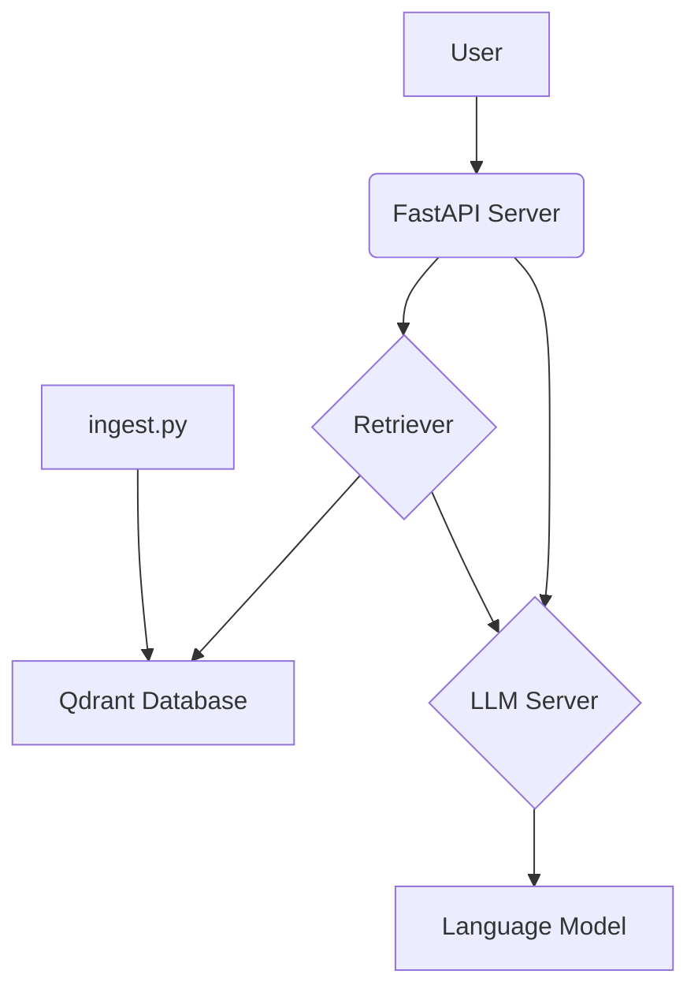

# QazCode NU

This project is a Retrieval-Augmented Generation (RAG) application that uses a vector database to retrieve relevant documents and a large language model to generate answers.

## Architecture



## How to run the project

1.  **Install dependencies:**
    ```bash
    uv sync
    ```

2.  **Download the vector model:**
    The vector model is not included in this repository due to its size. You need to download it from this [Google Drive link](https://drive.google.com/drive/folders/1j04pAcyIhxgHAxqTwBsP_-Xn9sm5pPgo?usp=drive_link) and place it in the root of the project. The file name should be `storage.sqlite`.

3.  **Run the application:**
    ```bash
    uv run uvicorn src.mock_server:app --host 0.0.0.0 --port 8000
    ```

## How to run the tests

To run the evaluation script, use the following command:
```bash
uv run python evaluate.py
```
